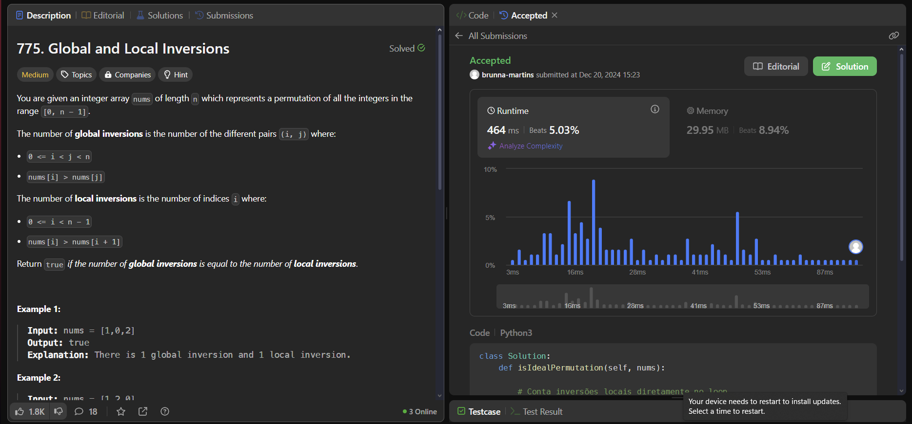
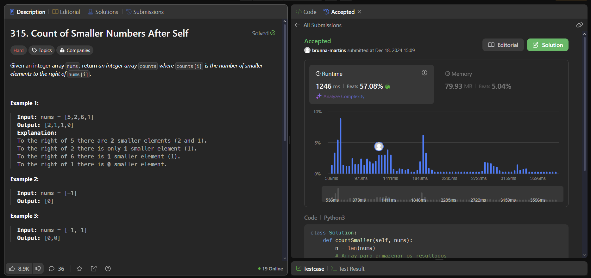
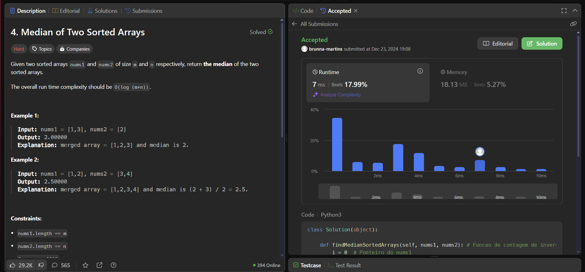

# D&C - Questões de LeetCode

**Número da Lista**: 3<br>
**Conteúdo da Disciplina**: Dividir e Conquistar<br>

## Alunos
|Matrícula | Aluno |
| -- | -- |
| 21/1029156  |  [Brunna Louise Martins Rocha](https://github.com/brunna-martins) |
| 21/1043727  |  [Pedro Cabeceira de Freitas](https://github.com/pkbceira03) |

## Sobre 

O projeto consiste na resolução de 3 exercícios da plataforma LeetCode.

### Global and Local Inversions (Medium)

Link do Problema: [clique aqui](https://leetcode.com/problems/global-and-local-inversions/description/) <br>
Link do Código (GitHub): [clique aqui](https://github.com/projeto-de-algoritmos-2024/D-C_LeetCode/blob/master/Global_and_Local_Inversions.py) <br><br>
<br>

### Count of Smaller Numbers After Self (Hard)

Link do Problema: [clique aqui](https://leetcode.com/problems/count-of-smaller-numbers-after-self/description/) <br>
Link do Código (GitHub): [clique aqui](https://github.com/projeto-de-algoritmos-2024/D-C_LeetCode/blob/master/count_of_smaller_numbers_after_self.py) <br><br>
<br>

### Median of Two Sorted Arrays (Hard)

Link do Problema: [clique aqui](https://leetcode.com/problems/median-of-two-sorted-arrays/description/)<br>
Link do Código (GitHub): [clique aqui](https://github.com/projeto-de-algoritmos-2024/D-C_LeetCode/blob/master/median_of_two_sorted_arrays.py) <br><br>
 <br>


## Instalação 
**Linguagem**: Python<br>
**Framework**: n/a<br>

**Ubuntu**:

Para rodar, é preciso ter instalado o Python 3.

```
$ sudo apt-get update
$ sudo apt-get install python3.6
```

## Uso 

Para testar o código na IDE de sua preferência, após realizada a instalação do Python3, você deve instanciar a classe Solution de cada arquivo. Em seguida, chame a primeira função declarada em cada arquivo com a quantidade e o tipo de argumentos especificados. Lembre-se de chamá-la dentro de uma função print() para visualizar o retorno do algoritmo via terminal.

O código está otimizado para rodar no ambiente do LeetCode. Basta copiar e colar o código no link da respectiva questão (consultar links acima).

## Apresentação

Clique na thumbnail abaixo para acessar o vídeo no YouTube.

[](https://www.youtube.com/watch?v=2LFrZiy-c8o)

